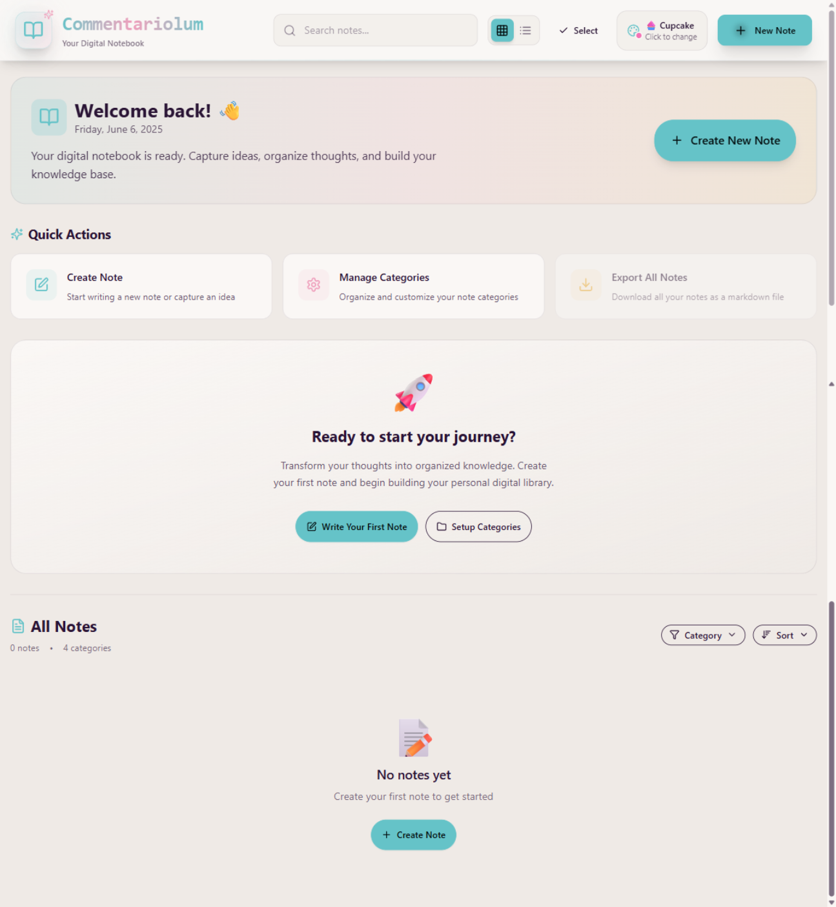
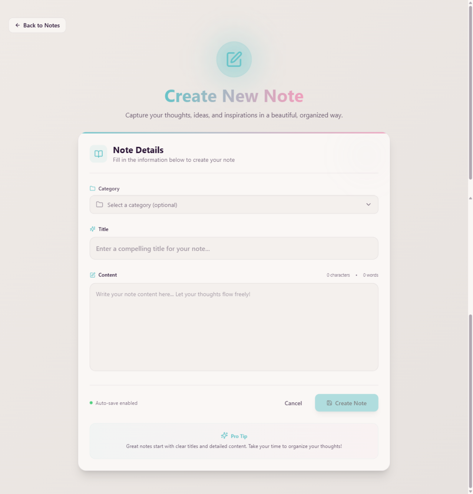

# Commentariolum 

## Screenshots

### Homepage dengan Cupcake Theme (No Notes)


*Empty state homepage dengan Cupcake theme - Tampilan ketika belum ada catatan*

### Create Page - Form Interface


*Detail tampilan form pembuatan catatan dengan category selector dan rich editor*

## 🛠️ Tech Stack

### Backend Infrastructure
- **Node.js** 
- **Express.js**
- **MongoDB** 
- **Mongoose** 
- **Upstash Redis** 
- **CORS** 
- **dotenv** 

### Frontend Technologies
- **React 19** 
- **Vite** 
- **React Router v7** 
- **Tailwind CSS** 
- **DaisyUI** 
- **Lucide React** 
- **Axios** 
- **React Hot Toast** 


## 📁 Project Structure

```
Commentariolum/
├── 📂 backend/                    # Server-side application
│   ├── 📂 src/
│   │   ├── 📂 config/            # Database & Redis configuration
│   │   │   ├── db.js            
│   │   │   └── upstash.js        
│   │   ├── 📂 controllers/       # Business logic & API handlers
│   │   │   ├── notesController.js    
│   │   │   └── categoryController.js 
│   │   ├── 📂 middleware/        # middleware
│   │   │   └── rateLimiter.js    
│   │   ├── 📂 models/            # Database schemas
│   │   │   ├── Note.js           
│   │   │   └── Category.js       
│   │   ├── 📂 routes/            # API route definitions
│   │   │   ├── notesRoutes.js    
│   │   │   └── categoryRoutes.js 
│   └── package.json              # Backend dependencies
│   │   └── server.js             # Express server entry point
├── 📂 frontend/                   # Client-side application
│   ├── 📂 src/
│   │   ├── 📂 components/        # Reusable React components
│   │   │   ├── Navbar.jsx        
│   │   │   ├── NoteCard.jsx      
│   │   │   ├── CategoryManager.jsx 
│   │   │   ├── CategorySelector.jsx 
│   │   │   ├── NotesNotFound.jsx 
│   │   │   └── RateLimitedUI.jsx 
│   │   ├── 📂 pages/             # Page components
│   │   │   ├── HomePage.jsx      
│   │   │   ├── CreatePage.jsx    
│   │   │   └── NoteDetailPage.jsx 
│   │   ├── 📂 lib/               # Utility libraries
│   │   │   ├── axios.js          
│   │   │   └── utils.js          
│   │   ├── App.jsx               # Root component with routing
│   │   └── main.jsx              # Application entry point
│   ├── tailwind.config.js        
│   ├── vite.config.js            
│   └── package.json              
├── 📂 readmeAssets/              # Documentation screenshots
├── 📂 assetsReadme/              # Additional documentation images
└── README.md                     # Project documentation
```

## Installation & Setup

### Prerequisites
- **Node.js** v16 atau lebih tinggi
- **MongoDB** database (local atau cloud seperti MongoDB Atlas)
- **Upstash Redis** account untuk rate limiting
- **Git** untuk version control

### 1. Clone Repository
```bash
git clone https://github.com/ArkanWiryaS/Commentariolum.git
cd Commentariolum
```

### 2. Environment Configuration
Buat file `.env` di dalam folder `backend/` dengan konfigurasi berikut:

```env
# Database Configuration
MONGO_URI=your_mongodb_connection_string

# Server Configuration  
PORT=5001
NODE_ENV=development

# Redis Configuration (Upstash)
UPSTASH_REDIS_REST_URL=your_upstash_redis_url
UPSTASH_REDIS_REST_TOKEN=your_upstash_redis_token
```

### 3. Install Dependencies
```bash
# Install semua dependencies secara otomatis
npm run build

# Atau install manual step by step
npm install --prefix backend
npm install --prefix frontend
```

### 4. Development Mode
```bash
# Terminal 1: Start backend server (dengan nodemon hot reload)
cd backend
npm run dev

# Terminal 2: Start frontend development server (dengan Vite HMR)
cd frontend  
npm run dev
```

**Access URLs:**
- Frontend: `http://localhost:5173`
- Backend API: `http://localhost:5001`

### 5. Production Deployment
```bash
# Build aplikasi untuk production
npm run build

# Start production server
npm start
```

## 🔗 API Documentation

### Base URL
```
Development: http://localhost:5001/api
Production: https://your-domain.com/api
```

### Notes Endpoints

| Method | Endpoint | Description | Request Body | Response |
|--------|----------|-------------|--------------|----------|
| `GET` | `/api/notes` | Get all notes with category info | - | Array of notes |
| `GET` | `/api/notes/:id` | Get specific note by ID | - | Single note object |
| `POST` | `/api/notes` | Create new note | `{title, content, categoryId?}` | Created note |
| `PUT` | `/api/notes/:id` | Update existing note | `{title?, content?, categoryId?}` | Updated note |
| `DELETE` | `/api/notes/:id` | Delete note | - | Success message |

### Categories Endpoints

| Method | Endpoint | Description | Request Body | Response |
|--------|----------|-------------|--------------|----------|
| `GET` | `/api/categories` | Get all categories | - | Array of categories |
| `GET` | `/api/categories/:id` | Get specific category | - | Single category |
| `GET` | `/api/categories/:id/notes` | Get notes by category | - | Array of notes |
| `POST` | `/api/categories` | Create new category | `{name, description?, color?, icon?}` | Created category |
| `PUT` | `/api/categories/:id` | Update category | `{name?, description?, color?, icon?}` | Updated category |
| `DELETE` | `/api/categories/:id` | Delete category | - | Success message |

### Request/Response Examples

#### Create Note
```javascript
// POST /api/notes
{
  "title": "My First Note",
  "content": "This is the content of my note...",
  "categoryId": "64a7b8c9d1e2f3g4h5i6j7k8" // Optional
}

// Response
{
  "_id": "64a7b8c9d1e2f3g4h5i6j7k9",
  "title": "My First Note",
  "content": "This is the content of my note...",
  "categoryId": {
    "_id": "64a7b8c9d1e2f3g4h5i6j7k8",
    "name": "Personal",
    "color": "primary",
    "icon": "folder"
  },
  "createdAt": "2024-01-01T00:00:00.000Z",
  "updatedAt": "2024-01-01T00:00:00.000Z"
}
```

#### Error Response
```javascript
{
  "message": "Note not found", // Error description
  "status": 404               // HTTP status code
}
```

## 🏗️ Architecture & Design Patterns

### Backend Architecture
```
📦 MVC Pattern Implementation
├──  Models (MongoDB + Mongoose)
│   ├── Data validation & schema definition
│   ├── Database indexing for performance
│   └── Relationship management (Note ↔ Category)
├──  Controllers (Business Logic)
│   ├── CRUD operations dengan error handling
│   ├── Data validation & sanitization
│   └── Response formatting & status codes
├──  Routes (API Endpoints)
│   ├── RESTful API design
│   ├── HTTP method conventions
│   └── URL parameter handling
└──  Middleware Stack
    ├── CORS configuration
    ├── JSON body parsing
    ├── Rate limiting dengan Redis
    └── Error handling middleware
```

### Frontend Architecture
```
Component-Based Architecture
├──  Pages (Route Components)
│   ├── HomePage - Main dashboard dengan advanced filtering
│   ├── CreatePage - Note creation dengan live preview
│   └── NoteDetailPage - View/edit individual notes
├──  Components (Reusable UI)
│   ├── Navbar - Navigation dengan theme switcher
│   ├── NoteCard - Individual note display dengan actions
│   ├── CategoryManager - CRUD interface untuk categories
│   └── Utility Components (Loading, Empty states, etc.)
├──  Styling Strategy
│   ├── Tailwind CSS untuk utility-first approach
│   ├── DaisyUI untuk consistent component design
│   └── Custom CSS untuk specific animations
└──  State Management
    ├── React Hooks untuk local state
    ├── Prop drilling untuk component communication
    └── LocalStorage untuk persistence (themes, etc.)
```

### Database Schema Design
```javascript
// Note Schema dengan optimizations
{
  title: { type: String, required: true },
  content: { type: String, required: true },
  categoryId: { 
    type: ObjectId, 
    ref: 'Category',
    index: true  // Indexed untuk fast queries
  },
  tanggal: { type: Date },
  timestamps: true  // Auto createdAt/updatedAt
}

// Category Schema dengan constraints
{
  name: { 
    type: String, 
    required: true, 
    maxLength: 50,
    index: true  // Indexed untuk search
  },
  description: { type: String, maxLength: 200 },
  color: { 
    type: String, 
    enum: ['primary', 'secondary', 'accent', ...],
    default: 'primary'
  },
  icon: { type: String, default: 'Folder' },
  noteCount: { type: Number, default: 0 }  // Denormalized untuk performance
}
```

### Development Workflow
```bash
# Development setup
npm run dev          # Start both frontend & backend
npm run lint         # Check code quality
npm run build        # Production build
npm run preview      # Preview production build

# Backend specific
cd backend
npm run dev          # Start dengan nodemon
npm start            # Production start

# Frontend specific  
cd frontend
npm run dev          # Vite dev server
npm run build        # Build untuk production
npm run preview      # Preview build results
```

## 🤝 Contributing

### Development Guidelines
1. **Fork** repository ini
2. **Create** feature branch (`git checkout -b feature/AmazingFeature`)
3. **Commit** changes dengan descriptive messages
4. **Push** ke branch (`git push origin feature/AmazingFeature`)
5. **Open** Pull Request dengan detailed description


### Common Issues & Solutions

#### MongoDB Connection Issues
```bash
# Error: MongoDB connection failed
# Solutions:
1. Check if MongoDB service is running
2. Verify MONGO_URI in .env file
3. Check network access (if using MongoDB Atlas)
4. Ensure database user has proper permissions
```

#### Redis Rate Limiting Issues
```bash
# Error: Redis connection failed
# Solutions:
1. Verify Upstash Redis credentials in .env
2. Check UPSTASH_REDIS_REST_URL format
3. Ensure UPSTASH_REDIS_REST_TOKEN is correct
4. Reset Redis keys if rate limit stuck
```

#### Frontend Connection Issues
```bash
# Error: Cannot connect to backend
# Solutions:
1. Ensure backend is running on port 5001
2. Check CORS configuration in server.js
3. Verify API endpoints are correct
4. Check browser console for specific errors
```

#### Build Issues
```bash
# Error: Vite build fails
# Solutions:
1. Clear node_modules and reinstall dependencies
2. Check for ESLint errors and fix them
3. Ensure all imports are correct
4. Verify Tailwind CSS configuration
```

## 📄 License

This project is licensed under the **ISC License**. See the [LICENSE](LICENSE) file for details.

## 👨‍💻 Author

**ArkanWiryaS**
- GitHub: [@ArkanWiryaS](https://github.com/ArkanWiryaS)
- Repository: [Commentariolum](https://github.com/ArkanWiryaS/Commentariolum)
- Email: [Contact Developer](mailto:arkanwiryas@gmail.com)

---

<div align="center">
  <p><strong>Built with ❤️ </strong></p>
  <p>
    <a href="#commentariolum-">⬆️ Back to Top</a> •
    <a href="https://github.com/ArkanWiryaS/Commentariolum/issues">🐛 Report Bug</a> •
    <a href="https://github.com/ArkanWiryaS/Commentariolum/discussions">💬 Request Feature</a>
  </p>
</div>
