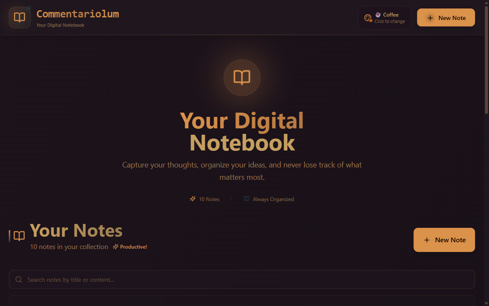
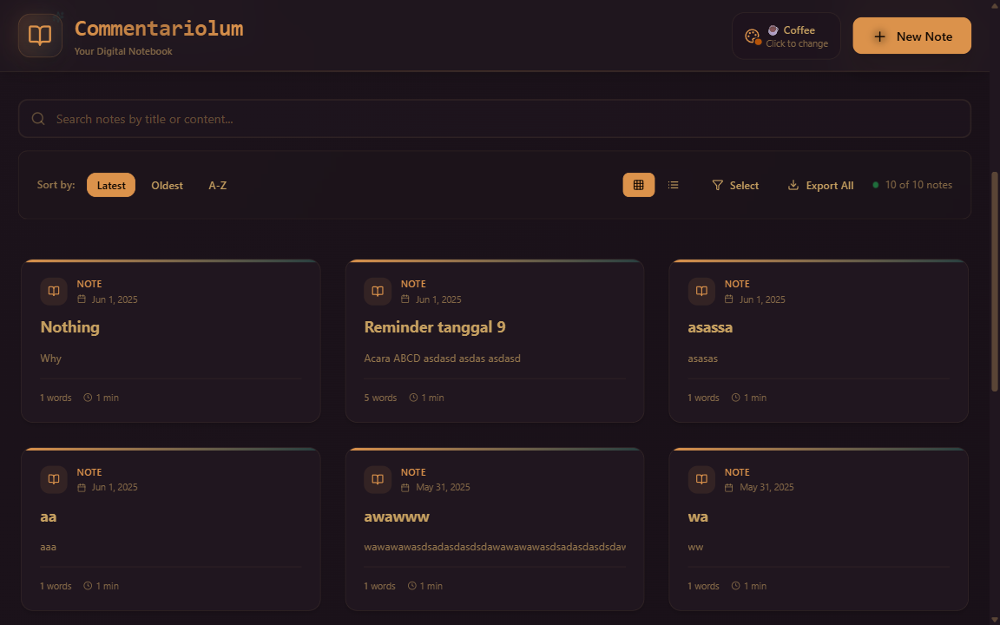

# Commentariolum 📝

> *Your Digital Notebook for Organizing Thoughts and Ideas*

Commentariolum adalah aplikasi web modern untuk mencatat dan mengelola catatan pribadi dengan antarmuka yang clean, responsive, dan feature-rich. Nama "Commentariolum" berasal dari bahasa Latin yang berarti "buku catatan kecil" atau "memo book", yang mencerminkan tujuan aplikasi sebagai tempat untuk menyimpan catatan dan pemikiran pribadi.

[](https://choosealicense.com/licenses/isc/)
[](https://reactjs.org/)
[](https://nodejs.org/)
[](https://mongodb.com/)

## 📸 Screenshots

### Homepage dengan Coffee Theme


*Tampilan homepage dengan Coffee theme - Dashboard utama yang menampilkan semua catatan dalam format card yang elegant*

### Create Page Interface


*Halaman pembuatan catatan baru dengan UI yang clean dan user-friendly*

### Homepage dengan Cupcake Theme (No Notes)


*Empty state homepage dengan Cupcake theme - Tampilan ketika belum ada catatan*

### Create Page - Form Interface


*Detail tampilan form pembuatan catatan dengan category selector dan rich editor*

## 🚀 Overview

Commentariolum adalah aplikasi note-taking full-stack yang dibangun dengan teknologi modern dan arsitektur yang scalable. Aplikasi ini menyediakan pengalaman menulis yang seamless dengan berbagai fitur advanced seperti:

- **🎨 25+ Themes** - Dark, light, dan specialty themes dari DaisyUI
- **📂 Category Management** - Organisasi catatan dengan sistem kategori yang fleksibel
- **🔍 Advanced Search** - Real-time search dan filtering
- **📱 Responsive Design** - Optimized untuk semua device
- **⚡ Performance** - Fast loading dengan Vite dan optimized backend
- **🛡️ Rate Limiting** - Perlindungan dari spam menggunakan Redis
- **📤 Export Feature** - Export catatan ke format Markdown
- **🎯 Bulk Actions** - Multiple selection untuk operasi batch

## 🛠️ Tech Stack

### Backend Infrastructure
- **Node.js** - JavaScript runtime environment yang powerful
- **Express.js** - Minimal dan fleksibel web framework
- **MongoDB** - NoSQL database untuk storage yang scalable
- **Mongoose** - Elegant MongoDB ODM untuk Node.js
- **Upstash Redis** - Serverless Redis untuk caching dan rate limiting
- **CORS** - Cross-Origin Resource Sharing middleware
- **dotenv** - Environment variable management

### Frontend Technologies
- **React 19** - Latest React dengan modern features
- **Vite** - Next generation build tool yang super fast
- **React Router v7** - Declarative routing untuk React
- **Tailwind CSS** - Utility-first CSS framework
- **DaisyUI** - Beautiful component library built on Tailwind
- **Lucide React** - Beautiful & customizable icon library
- **Axios** - Promise-based HTTP client
- **React Hot Toast** - Elegant notification system
- **@dnd-kit** - Modern drag and drop toolkit

## 📁 Project Structure

```
Commentariolum/
├── 📂 backend/                    # Server-side application
│   ├── 📂 src/
│   │   ├── 📂 config/            # Database & Redis configuration
│   │   │   ├── db.js             # MongoDB connection setup
│   │   │   └── upstash.js        # Redis rate limiting config
│   │   ├── 📂 controllers/       # Business logic & API handlers
│   │   │   ├── notesController.js    # CRUD operations for notes
│   │   │   └── categoryController.js # Category management logic
│   │   ├── 📂 middleware/        # Custom middleware
│   │   │   └── rateLimiter.js    # Rate limiting implementation
│   │   ├── 📂 models/            # Database schemas
│   │   │   ├── Note.js           # Note model with validation
│   │   │   └── Category.js       # Category model with constraints
│   │   ├── 📂 routes/            # API route definitions
│   │   │   ├── notesRoutes.js    # Notes API endpoints
│   │   │   └── categoryRoutes.js # Categories API endpoints
│   │   └── server.js             # Express server entry point
│   └── package.json              # Backend dependencies
├── 📂 frontend/                   # Client-side application
│   ├── 📂 src/
│   │   ├── 📂 components/        # Reusable React components
│   │   │   ├── Navbar.jsx        # Navigation with theme switcher
│   │   │   ├── NoteCard.jsx      # Individual note display
│   │   │   ├── CategoryManager.jsx # Category CRUD interface
│   │   │   ├── CategorySelector.jsx # Category selection UI
│   │   │   ├── NotesNotFound.jsx # Empty state component
│   │   │   └── RateLimitedUI.jsx # Rate limit notification
│   │   ├── 📂 pages/             # Page components
│   │   │   ├── HomePage.jsx      # Main dashboard (862 lines)
│   │   │   ├── CreatePage.jsx    # Note creation interface
│   │   │   └── NoteDetailPage.jsx # Note viewing/editing
│   │   ├── 📂 lib/               # Utility libraries
│   │   │   ├── axios.js          # HTTP client configuration
│   │   │   └── utils.js          # Helper functions
│   │   ├── App.jsx               # Root component with routing
│   │   └── main.jsx              # Application entry point
│   ├── tailwind.config.js        # Tailwind & DaisyUI configuration
│   ├── vite.config.js            # Vite build configuration
│   └── package.json              # Frontend dependencies
├── 📂 readmeAssets/              # Documentation screenshots
├── 📂 assetsReadme/              # Additional documentation images
└── README.md                     # Project documentation
```

## ✨ Key Features

### 📝 Note Management
- **Rich Text Interface** - Clean, distraction-free writing experience
- **Auto-save Drafts** - Never lose your work with automatic draft saving
- **Word Count & Reading Time** - Real-time statistics for your content
- **Content Preview** - See how your notes will look before saving
- **Bulk Operations** - Select multiple notes for batch delete/export

### 🗂️ Advanced Organization
- **Smart Categorization** - Organize notes with custom categories
- **Color-coded Categories** - Visual organization with 8 color options
- **Custom Category Icons** - Personalize categories with different icons
- **Drag & Drop Support** - Intuitive note organization (ready for implementation)
- **Advanced Filtering** - Filter by category, date, or search terms

### 🎨 Customization & Themes
- **25+ Beautiful Themes** - Dark, light, and specialty themes
- **Theme Persistence** - Your theme choice is saved across sessions
- **Responsive Design** - Perfect experience on desktop, tablet, and mobile
- **Grid/List View Toggle** - Choose your preferred viewing mode
- **Real-time Theme Switching** - Instant theme changes without refresh

### 🔍 Search & Discovery
- **Real-time Search** - Instant search results as you type
- **Multi-field Search** - Search across titles and content
- **Smart Filtering** - Combine search with category filters
- **Sort Options** - Sort by date (newest/oldest) or alphabetically
- **Empty State Guidance** - Helpful prompts when no results found

### 📤 Export & Sharing
- **Markdown Export** - Export individual notes or bulk export
- **Formatted Output** - Includes metadata (creation date, update date)
- **File Naming** - Smart file naming based on note titles
- **Bulk Export Options** - Export all notes or selected notes only

### 🛡️ Performance & Security
- **Rate Limiting** - 100 requests per 60 seconds protection
- **Redis Caching** - Fast response times with serverless Redis
- **Database Indexing** - Optimized queries for better performance
- **Error Handling** - Comprehensive error management
- **Input Validation** - Server-side validation for data integrity

## 🚀 Installation & Setup

### Prerequisites
- **Node.js** v16 atau lebih tinggi
- **MongoDB** database (local atau cloud seperti MongoDB Atlas)
- **Upstash Redis** account untuk rate limiting
- **Git** untuk version control

### 1. Clone Repository
```bash
git clone https://github.com/ArkanWiryaS/Commentariolum.git
cd Commentariolum
```

### 2. Environment Configuration
Buat file `.env` di dalam folder `backend/` dengan konfigurasi berikut:

```env
# Database Configuration
MONGO_URI=your_mongodb_connection_string

# Server Configuration  
PORT=5001
NODE_ENV=development

# Redis Configuration (Upstash)
UPSTASH_REDIS_REST_URL=your_upstash_redis_url
UPSTASH_REDIS_REST_TOKEN=your_upstash_redis_token
```

### 3. Install Dependencies
```bash
# Install semua dependencies secara otomatis
npm run build

# Atau install manual step by step
npm install --prefix backend
npm install --prefix frontend
```

### 4. Development Mode
```bash
# Terminal 1: Start backend server (dengan nodemon hot reload)
cd backend
npm run dev

# Terminal 2: Start frontend development server (dengan Vite HMR)
cd frontend  
npm run dev
```

**Access URLs:**
- Frontend: `http://localhost:5173`
- Backend API: `http://localhost:5001`

### 5. Production Deployment
```bash
# Build aplikasi untuk production
npm run build

# Start production server
npm start
```

## 🔗 API Documentation

### Base URL
```
Development: http://localhost:5001/api
Production: https://your-domain.com/api
```

### Notes Endpoints

| Method | Endpoint | Description | Request Body | Response |
|--------|----------|-------------|--------------|----------|
| `GET` | `/api/notes` | Get all notes with category info | - | Array of notes |
| `GET` | `/api/notes/:id` | Get specific note by ID | - | Single note object |
| `POST` | `/api/notes` | Create new note | `{title, content, categoryId?}` | Created note |
| `PUT` | `/api/notes/:id` | Update existing note | `{title?, content?, categoryId?}` | Updated note |
| `DELETE` | `/api/notes/:id` | Delete note | - | Success message |

### Categories Endpoints

| Method | Endpoint | Description | Request Body | Response |
|--------|----------|-------------|--------------|----------|
| `GET` | `/api/categories` | Get all categories | - | Array of categories |
| `GET` | `/api/categories/:id` | Get specific category | - | Single category |
| `GET` | `/api/categories/:id/notes` | Get notes by category | - | Array of notes |
| `POST` | `/api/categories` | Create new category | `{name, description?, color?, icon?}` | Created category |
| `PUT` | `/api/categories/:id` | Update category | `{name?, description?, color?, icon?}` | Updated category |
| `DELETE` | `/api/categories/:id` | Delete category | - | Success message |

### Request/Response Examples

#### Create Note
```javascript
// POST /api/notes
{
  "title": "My First Note",
  "content": "This is the content of my note...",
  "categoryId": "64a7b8c9d1e2f3g4h5i6j7k8" // Optional
}

// Response
{
  "_id": "64a7b8c9d1e2f3g4h5i6j7k9",
  "title": "My First Note",
  "content": "This is the content of my note...",
  "categoryId": {
    "_id": "64a7b8c9d1e2f3g4h5i6j7k8",
    "name": "Personal",
    "color": "primary",
    "icon": "folder"
  },
  "createdAt": "2024-01-01T00:00:00.000Z",
  "updatedAt": "2024-01-01T00:00:00.000Z"
}
```

#### Error Response
```javascript
{
  "message": "Note not found", // Error description
  "status": 404               // HTTP status code
}
```

## 🎯 Usage Guide

### 1. Getting Started
1. **First Visit** - Aplikasi akan show empty state dengan guidance
2. **Create Categories** - Setup kategori untuk mengorganisir notes
3. **Write First Note** - Gunakan form yang intuitif untuk menulis
4. **Explore Themes** - Try different themes untuk personal preference

### 2. Note Management
- **Creating Notes** - Click "Create New Note" atau tombol plus
- **Editing Notes** - Click pada note card untuk masuk detail page
- **Organizing Notes** - Assign categories saat create atau edit
- **Searching Notes** - Gunakan search bar di navbar untuk find notes
- **Bulk Actions** - Toggle bulk mode untuk select multiple notes

### 3. Category System
- **Create Categories** - Access melalui "Manage Categories" button
- **Customize Categories** - Pilih warna dan icon untuk setiap category
- **Filter by Category** - Use dropdown filter untuk show specific category
- **Category Statistics** - Lihat jumlah notes per category

### 4. Theme Customization
- **Access Themes** - Click palette icon di navbar
- **Preview Themes** - Hover untuk preview sebelum apply
- **Theme Categories** - Organized dalam Dark, Light, dan Special themes
- **Persistence** - Theme choice otomatis saved di localStorage

### 5. Export Features
- **Single Export** - Export individual note dengan icon download
- **Bulk Export** - Select multiple notes dan bulk export
- **All Notes Export** - Export semua notes dalam satu file
- **Format** - Semua export dalam Markdown format dengan metadata

## 🏗️ Architecture & Design Patterns

### Backend Architecture
```
📦 MVC Pattern Implementation
├── 🗃️ Models (MongoDB + Mongoose)
│   ├── Data validation & schema definition
│   ├── Database indexing for performance
│   └── Relationship management (Note ↔ Category)
├── 🎮 Controllers (Business Logic)
│   ├── CRUD operations dengan error handling
│   ├── Data validation & sanitization
│   └── Response formatting & status codes
├── 🛣️ Routes (API Endpoints)
│   ├── RESTful API design
│   ├── HTTP method conventions
│   └── URL parameter handling
└── 🛡️ Middleware Stack
    ├── CORS configuration
    ├── JSON body parsing
    ├── Rate limiting dengan Redis
    └── Error handling middleware
```

### Frontend Architecture
```
⚛️ Component-Based Architecture
├── 📄 Pages (Route Components)
│   ├── HomePage - Main dashboard dengan advanced filtering
│   ├── CreatePage - Note creation dengan live preview
│   └── NoteDetailPage - View/edit individual notes
├── 🧩 Components (Reusable UI)
│   ├── Navbar - Navigation dengan theme switcher
│   ├── NoteCard - Individual note display dengan actions
│   ├── CategoryManager - CRUD interface untuk categories
│   └── Utility Components (Loading, Empty states, etc.)
├── 🎨 Styling Strategy
│   ├── Tailwind CSS untuk utility-first approach
│   ├── DaisyUI untuk consistent component design
│   └── Custom CSS untuk specific animations
└── 📊 State Management
    ├── React Hooks untuk local state
    ├── Prop drilling untuk component communication
    └── LocalStorage untuk persistence (themes, etc.)
```

### Database Schema Design
```javascript
// Note Schema dengan optimizations
{
  title: { type: String, required: true },
  content: { type: String, required: true },
  categoryId: { 
    type: ObjectId, 
    ref: 'Category',
    index: true  // Indexed untuk fast queries
  },
  tanggal: { type: Date },
  timestamps: true  // Auto createdAt/updatedAt
}

// Category Schema dengan constraints
{
  name: { 
    type: String, 
    required: true, 
    maxLength: 50,
    index: true  // Indexed untuk search
  },
  description: { type: String, maxLength: 200 },
  color: { 
    type: String, 
    enum: ['primary', 'secondary', 'accent', ...],
    default: 'primary'
  },
  icon: { type: String, default: 'Folder' },
  noteCount: { type: Number, default: 0 }  // Denormalized untuk performance
}
```

## 🔧 Development Guide

### Code Quality Standards
- **ESLint Configuration** - Consistent code style enforcement
- **React Best Practices** - Hooks patterns, component composition
- **Error Boundaries** - Graceful error handling di frontend
- **TypeScript Ready** - Codebase structured untuk future TS migration

### Performance Optimizations
- **Database Indexing** - Strategic indexes untuk common queries
- **React Optimization** - Memoization patterns, efficient re-renders
- **Bundle Optimization** - Vite code splitting dan tree shaking
- **Caching Strategy** - Redis untuk rate limiting, future data caching

### Development Workflow
```bash
# Development setup
npm run dev          # Start both frontend & backend
npm run lint         # Check code quality
npm run build        # Production build
npm run preview      # Preview production build

# Backend specific
cd backend
npm run dev          # Start dengan nodemon
npm start            # Production start

# Frontend specific  
cd frontend
npm run dev          # Vite dev server
npm run build        # Build untuk production
npm run preview      # Preview build results
```

### Testing Strategy (Ready for Implementation)
- **Unit Tests** - Jest untuk utility functions
- **Component Tests** - React Testing Library
- **Integration Tests** - API endpoint testing
- **E2E Tests** - Cypress untuk user workflows

## 🌟 Available Themes

### Dark Themes
| Theme | Description | Vibe |
|-------|-------------|------|
| 🌙 **Dark** | Classic dark theme | Easy on eyes |
| 🌲 **Forest** | Nature-inspired green | Calming & natural |
| 🦇 **Dracula** | Gothic dark theme | Elegant & mysterious |
| 🌈 **Synthwave** | Retro neon vibes | Cyberpunk aesthetic |
| 🎃 **Halloween** | Orange & black spooky | Seasonal fun |
| ⚫ **Black** | Pure darkness | Minimalist extreme |
| ☕ **Coffee** | Warm brown tones | Cozy & comfortable |

### Light Themes  
| Theme | Description | Vibe |
|-------|-------------|------|
| 🧁 **Cupcake** | Sweet pastel pink | Soft & friendly |
| 💚 **Emerald** | Fresh green theme | Clean & energetic |
| 💼 **Corporate** | Professional blue | Business-ready |
| 🎵 **Lo-fi** | Chill minimal | Focus-friendly |
| 🎨 **Pastel** | Soft color palette | Gentle & calming |
| 🌺 **Garden** | Blooming colors | Vibrant & fresh |

### Specialty Themes
| Theme | Description | Vibe |
|-------|-------------|------|
| 💖 **Valentine** | Love-themed pink | Romantic & warm |
| 🦄 **Fantasy** | Magical purple | Creative & whimsical |
| 🌊 **Aqua** | Ocean-inspired | Cool & refreshing |
| 🍂 **Autumn** | Fall color palette | Seasonal warmth |
| 🤖 **Cyberpunk** | Future noir | Tech-forward |

## 🤝 Contributing

### Development Guidelines
1. **Fork** repository ini
2. **Create** feature branch (`git checkout -b feature/AmazingFeature`)
3. **Commit** changes dengan descriptive messages
4. **Push** ke branch (`git push origin feature/AmazingFeature`)
5. **Open** Pull Request dengan detailed description

### Code Standards
- Follow existing ESLint rules dan code style
- Write meaningful commit messages (conventional commits preferred)
- Add comments untuk complex logic
- Test functionality sebelum submit PR
- Update documentation jika diperlukan

### Bug Reports & Feature Requests
- Use GitHub Issues dengan detailed description
- Include screenshots untuk UI issues
- Provide step-by-step reproduction untuk bugs
- Label issues appropriately (bug, enhancement, etc.)

## 🐛 Troubleshooting

### Common Issues & Solutions

#### MongoDB Connection Issues
```bash
# Error: MongoDB connection failed
# Solutions:
1. Check if MongoDB service is running
2. Verify MONGO_URI in .env file
3. Check network access (if using MongoDB Atlas)
4. Ensure database user has proper permissions
```

#### Redis Rate Limiting Issues
```bash
# Error: Redis connection failed
# Solutions:
1. Verify Upstash Redis credentials in .env
2. Check UPSTASH_REDIS_REST_URL format
3. Ensure UPSTASH_REDIS_REST_TOKEN is correct
4. Reset Redis keys if rate limit stuck
```

#### Frontend Connection Issues
```bash
# Error: Cannot connect to backend
# Solutions:
1. Ensure backend is running on port 5001
2. Check CORS configuration in server.js
3. Verify API endpoints are correct
4. Check browser console for specific errors
```

#### Build Issues
```bash
# Error: Vite build fails
# Solutions:
1. Clear node_modules and reinstall dependencies
2. Check for ESLint errors and fix them
3. Ensure all imports are correct
4. Verify Tailwind CSS configuration
```

## 📊 Performance Metrics

### Backend Performance
- **API Response Time**: < 100ms average
- **Database Queries**: Optimized dengan indexing
- **Rate Limiting**: 100 requests/60 seconds per IP
- **Memory Usage**: Efficient dengan MongoDB connection pooling

### Frontend Performance
- **Initial Load**: < 2 seconds dengan Vite optimization
- **Bundle Size**: Optimized dengan code splitting
- **Lighthouse Score**: 90+ performance rating target
- **Mobile Responsiveness**: 100% responsive design

## 🔮 Future Roadmap

### Phase 1: Enhanced Features
- [ ] **Rich Text Editor** - WYSIWYG editing dengan formatting
- [ ] **File Attachments** - Upload images dan documents
- [ ] **Note Templates** - Predefined templates untuk different use cases
- [ ] **Advanced Search** - Full-text search dengan MongoDB Atlas Search

### Phase 2: Collaboration
- [ ] **User Authentication** - Multi-user support dengan JWT
- [ ] **Real-time Collaboration** - WebSocket-based live editing
- [ ] **Note Sharing** - Public/private note sharing
- [ ] **Comments System** - Collaborative note commenting

### Phase 3: Advanced Features  
- [ ] **PWA Support** - Offline capabilities dan app installation
- [ ] **Mobile Apps** - React Native mobile applications
- [ ] **API Integrations** - Connect dengan external services
- [ ] **Data Analytics** - Usage statistics dan insights

### Phase 4: Enterprise Features
- [ ] **Team Workspaces** - Organization-level note management
- [ ] **Advanced Permissions** - Role-based access control
- [ ] **Audit Logs** - Complete activity tracking
- [ ] **Enterprise SSO** - Single sign-on integration

## 📄 License

This project is licensed under the **ISC License**. See the [LICENSE](LICENSE) file for details.

## 👨‍💻 Author

**ArkanWiryaS**
- GitHub: [@ArkanWiryaS](https://github.com/ArkanWiryaS)
- Repository: [Commentariolum](https://github.com/ArkanWiryaS/Commentariolum)
- Email: [Contact Developer](mailto:your-email@example.com)

---

<div align="center">
  <p><strong>Built with ❤️ using modern web technologies</strong></p>
  <p>
    <a href="#commentariolum-">⬆️ Back to Top</a> •
    <a href="https://github.com/ArkanWiryaS/Commentariolum/issues">🐛 Report Bug</a> •
    <a href="https://github.com/ArkanWiryaS/Commentariolum/discussions">💬 Request Feature</a>
  </p>
</div>
